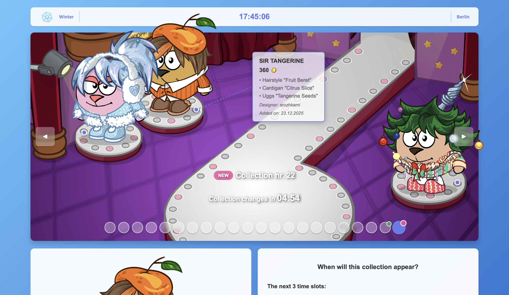

# Fashion Catalog

A full-featured seasonal fashion management system for tracking outfit collections in an online MMORPG. Built in 10 days with React + Vite, serving ~50 unique daily users with 125 views (90+ users, 280+ views on new collection days).

<!-- **Live:** [---.vercel.app](https://---.vercel.app) -->




## Overview

This system addresses the practical challenge of managing rotating fashion collections across multiple seasons. What started as a simple tracking tool evolved into a comprehensive content management platform with both public catalog and administrative capabilities.

## Features

### Public Interface

**Dynamic Seasonal Theming**  
Four complete collections (Spring, Summer, Autumn, Winter) with season-specific backgrounds, color schemes, and outfit arrangements. Supports independent podium modes where each runway displays different collections.

**Interactive Catalog**  
Three viewing modes (carousel, gallery, table) with filtering by currency, selection status, and visibility. Real-time price calculation across multiple currencies with conversion estimates.

**Collection Scheduling**  
Time-based rotation calculator with timezone support. Users can track when specific collections will appear across different regions.

**Responsive Design**  
Adapts across devices with thoughtful layout decisions based on content hierarchy and context.

### Administrative Tools

**Visual Placement Editor**  
Drag outfits directly on the preview canvas to adjust x/y position and scale. Changes persist to configuration files, eliminating manual coordinate editing.

**CRUD Operations**  
Full outfit management across all seasons and collections. Create, edit, and delete outfits with proper data integrity between prices, placements, and assets.

**Staging Area**  
Preview placement changes before applying them live. Compare multiple podium configurations side-by-side.

**Collection Management**  
Configure rotation schedules, independent podium modes, and season-specific parameters.

## Architecture

Built on domain-driven design with clear separation between business logic, presentation, and infrastructure.

```
fashion-app/
├── src/
│   ├── domain/                      # Business logic
│   │   └── outfit/
│   │       ├── OutfitModel.js       # Core entity model
│   │       ├── outfitService.js     # Domain operations
│   │       └── test.js              # Domain tests
│   │
│   ├── components/                  # Feature components
│   │   ├── Carousel/                # Main outfit display
│   │   │   ├── Carousel.jsx
│   │   │   ├── CarouselControls.jsx
│   │   │   ├── hooks/
│   │   │   │   ├── useOutfitDrag.js
│   │   │   │   └── useDevPositions.js
│   │   │   └── components/
│   │   │       └── DevPanel.jsx
│   │   │
│   │   ├── CatalogOverview/         # Multi-mode catalog
│   │   │   ├── CatalogOverview.jsx
│   │   │   └── components/
│   │   │       ├── ControlPanel.jsx
│   │   │       ├── OutfitCard.jsx
│   │   │       ├── OutfitTable/
│   │   │       │   ├── OutfitTable.jsx
│   │   │       │   ├── PriceCell.jsx
│   │   │       │   └── TimesCell.jsx
│   │   │       └── SelectedList.jsx
│   │   │
│   │   ├── OutfitCRUD/              # Admin panel
│   │   │   ├── OutfitCrud.jsx
│   │   │   ├── components/
│   │   │   │   ├── AddEditOutfitModal.jsx
│   │   │   │   ├── PlacementEditor.jsx
│   │   │   │   ├── StagingArea.jsx
│   │   │   │   ├── CollectionConfigPanel.jsx
│   │   │   │   ├── OutfitCard.jsx
│   │   │   │   ├── SeasonSelector.jsx
│   │   │   │   └── StatsBar.jsx
│   │   │   ├── hooks/
│   │   │   │   ├── useOutfits.js
│   │   │   │   └── useReorder.js
│   │   │   └── utils/
│   │   │       └── api.js
│   │   │
│   │   ├── PriceOverlay/            # Interactive price tags
│   │   ├── Calculator/              # Time calculator
│   │   ├── ItemDetail/              # Detailed outfit modal
│   │   ├── Header/                  # Header with timezone
│   │   ├── Footer/                  # Footer with totals
│   │   └── Sum/                     # Price summary
│   │
│   ├── hooks/                       # Shared React hooks
│   │   ├── useOutfits.js
│   │   ├── useCollectionTimer.js
│   │   ├── useImagePreloader.js
│   │   └── useSeasonTheme.js
│   │
│   ├── contexts/                    # React Context API
│   │   └── SeasonContext.jsx
│   │
│   ├── constants/                   # Configuration
│   │   ├── seasonConfig.js
│   │   ├── placementConfig.js
│   │   ├── podiumConfig.js
│   │   ├── collectionNumber.js
│   │   ├── prices-spring.json
│   │   ├── prices-summer.json
│   │   ├── prices-autumn.json
│   │   └── prices-winter.json
│   │
│   └── utils/                       # Utility functions
│       ├── pricesLoader.js
│       ├── priceUtils.jsx
│       ├── rumbCalc.js
│       ├── timeUtils.js
│       ├── seasonUtils.js
│       ├── filenameUtils.js
│       └── schedule.js
│
├── public/assets/                   # Static assets
│   ├── background/                  # Season backgrounds
│   ├── transparent/                 # Outfit images
│   │   ├── spring/                  # 81 outfits
│   │   ├── summer/                  # 4 outfits
│   │   ├── autumn/                  # 3 outfits
│   │   └── winter/                  # 66+ outfits
│   ├── closeups/                    # Detail images
│   └── currencies/                  # Currency icons
│
└── dev-server.cjs                   # Local backend server
```

## Design Patterns

### Domain Model

All outfit information flows through a unified `Outfit` model, encapsulating formatting logic and context awareness. This reduces coupling between data structure and presentation.

```javascript
const outfit = new Outfit(data, {
  collectionId: 1,
  podiumIndex: 0,
  season: "winter",
});

console.log(outfit.displayPrice); // "1 500"
console.log(outfit.getTransparentImage()); // "/assets/transparent/winter/1_1.png"
```

### Service Layer

Business logic exists independently of React components, enabling testing without mounting and ensuring consistent behavior across different contexts.

```javascript
const outfits = outfitService.getOutfits(pricesData, season, collectionId);
const totals = outfitService.calculateTotal(outfits);
const display = outfitService.getOutfitDisplay(outfit, isMobile);
```

### Independent Podiums

Certain seasons support different collections across runways simultaneously. The system determines appropriate collection IDs based on time and position.

```javascript
if (hasIndependentPodiums(season)) {
  const collectionId = getCollectionForPodium(season, podiumIndex, timeIndex);
}
```

## Installation

```bash
# Install dependencies
npm install

# Run frontend development server
npm run dev

# Run backend service (separate terminal)
npm run dev:server

# Build for production
npm run build

# Preview production build
npm run preview
```

## Technologies

- **React 18** — UI library with hooks
- **Vite** — Build tool and dev server
- **React Context API** — Global state management
- **Embla Carousel** — Touch-friendly carousel
- **CSS Modules** — Scoped component styling
- **Node.js** — Backend service for admin operations
- **Vercel** — Frontend deployment

## Data Structure

### Price Format (JSON)

```json
{
  "1": {
    "image": "1_1.png",
    "price": "360",
    "currency": "coins",
    "setName": "Some outfit",
    "name": ["Some hairstyle", "Some dress", "Some shoes"],
    "designer": "designer",
    "date": "2025-12-20"
  }
}
```

### Placement Configuration

```javascript
export const SEASONAL_PLACEMENT_OVERRIDES = {
  winter: {
    1: {
      positions: [
        {
          podiumIndex: 0,
          x: 17.17,
          y: 31.84,
          scale: 0.187,
        },
        {
          podiumIndex: 1,
          x: 31.49,
          y: 18.31,
          scale: 0.163,
        },
        {
          podiumIndex: 2,
          x: 88.83,
          y: 50.99,
          scale: 0.17,
        },
      ],
    },
  },
};
```

## Adding New Collections

1. Add outfit images to `/public/assets/transparent/{season}/`
2. Define price data in `src/constants/prices-{season}.json`
3. Configure positioning using the visual placement editor
4. Update season config for new collection rotations

Alternatively, enable dev mode by setting `VITE_ENABLE_DEV_PANEL=true` in `.env.local` and use the integrated development panel for position adjustments and collection management.

## Deployment

- **Frontend:** Automatically deployed to Vercel on push to main
- **Backend:** Local development server (used for admin operations only)

## Performance

Strategic optimizations based on measured needs:

- Image preloading for smooth transitions
- Lazy loading for off-screen components
- Memoized calculations for price totals
- Efficient re-renders with React.memo
- Position caching for drag operations

## Future Improvements

Potential enhancements based on usage patterns and technical considerations:

- Export lists to CSV/PDF
- Push notifications for collection rotations
- Multi-language support

## License

Created for educational purposes as a fan site. All game assets and intellectual property belong to their respective owners.
